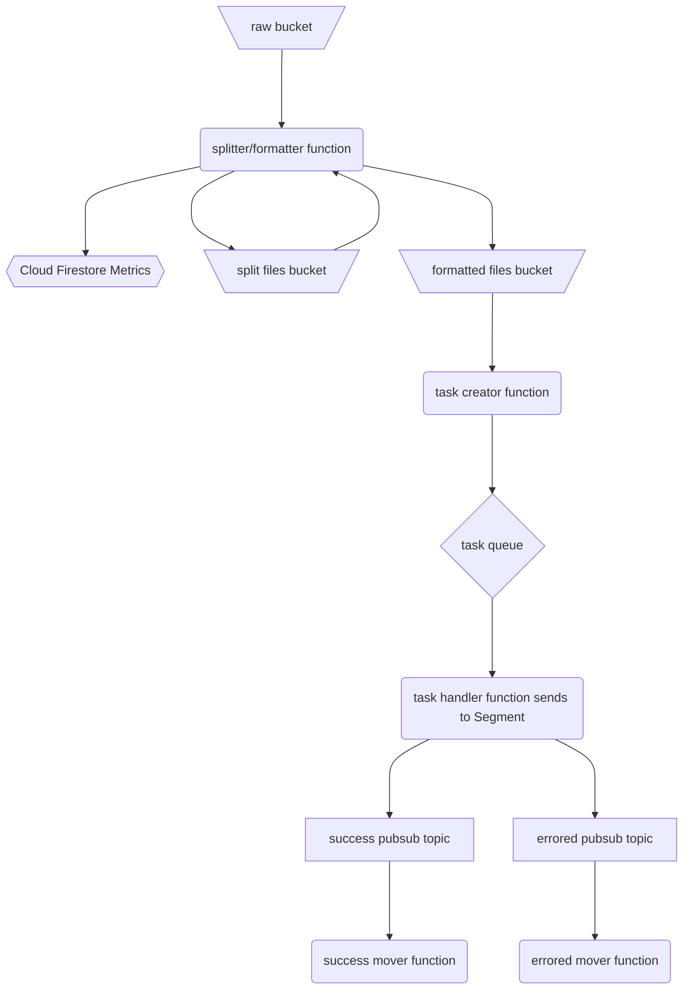

# diagrams
repo for text based diagrams

## mermaid test

```mermaid
  flowchart TD;
      A[\raw bucket/]--->B(splitter/formatter function);
      B--->H{{Cloud Firestore Metrics}};
      B--->C[\split files bucket/];
      C--->B;
      B--->D[\formatted files bucket/];
      D--->E(task creator function);
      E--->F{task queue};
      F--->G(task handler function sends to Segment)
      G--->I[success pubsub topic];
      G--->J[errored pubsub topic];
      I--->K(success mover function);
      J--->L(errored mover function);

```
